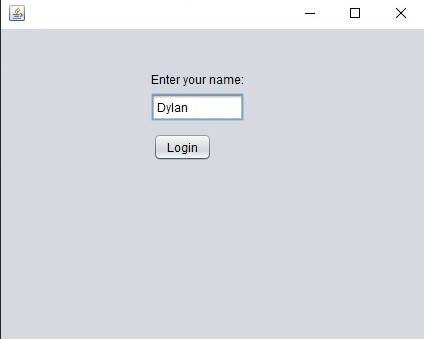
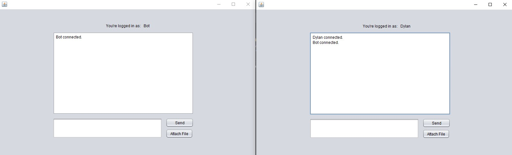
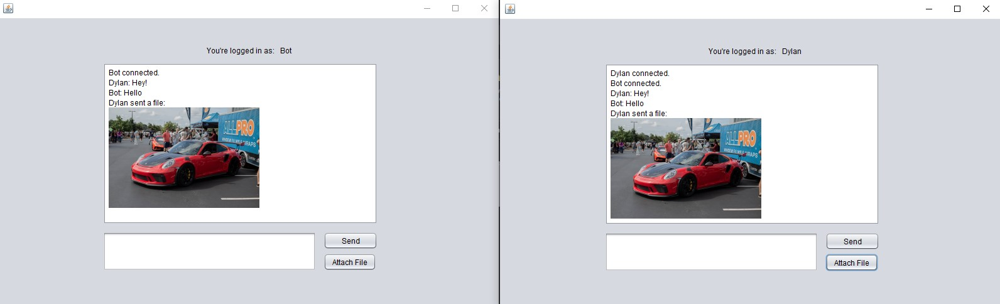

# Pixie - Screen & File Sharing
### Connect with other clients to chat, share files, and (eventually) share your screen.

## A Java Socket program created with the intention to learn more about networking and sharing data.

### Screenshots of working program before focusing on appearance:

Login screen
  

 

Both Clients connect
  

 

Clients communicate with text and images
  

 
